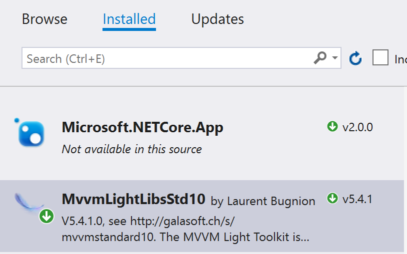

# Building the CoreMvvmLight app and running on Windows

After you get the repo, open it in Visual Studio 2017.

> Note that you must have the .NET Core cross-platform development workload installed in Visual Studio 2017. Run the Visual Studio installer and make sure that you have the following workload checked:


You can build the application in VS2017 and run it. This will open a Windows console and you will be presented with a choice:


Type 1 to use a test service. You will be asked to enter two operands, and then the service will say "I don't know how to count, I am just a test program".


Run the application again, and this time select "2" for the real service. After entering the two operands, you will see a short wait and then the correct answer:


# How it works

Opening the Solution will show how this works:

## Checking the dependencies

Since this sample uses MVVM Light, we added it to the project by using Nuget. In Visual Studio, you can see this by right clicking on the Solution and selecting *Manage Nuget Packages...*. This opens a dialog in which you can see that we added MVVM Light for .NET Standard as a reference:



Of course, since this is a .NET Core application, you need to make sure to select the .NET Standard version of MVVM Light. The package name is [mvvmlightlibsstd10](https://www.nuget.org/packages/MvvmLightLibsStd10/).

## Creating the interface

The service definition is contained in [Model/IDataService.cs](https://github.com/lbugnion/sample-crossplatform-mvvmdotnetstandard/blob/master/CoreWithMvvmLight/CoreWithMvvmLight/Model/IDataService.cs):

```cs
public interface IDataService
{
    Task<string> GetResult(int num1, int num2);
}
```

This is a simple interface with just one method that can be executed asynchronously.

## Implementing a test version of the service

The test service is contained in [Model/TestDataService.cs](https://github.com/lbugnion/sample-crossplatform-mvvmdotnetstandard/blob/master/CoreWithMvvmLight/CoreWithMvvmLight/Model/TestDataService.cs). It uses a TaskCompletionSource instance to simulate an asynchronous operation and returns a text immediately.

```cs
public class TestDataService : IDataService
{
    public Task<string> GetResult(int num1, int num2)
    {
        var tcs = new TaskCompletionSource<string>();
        tcs.SetResult("I don't know how to count, I am just a test program");
        return tcs.Task;
    }
}
```

## Implementing a real version of the service

The "real" service is in [Model/DataService.cs](https://github.com/lbugnion/sample-crossplatform-mvvmdotnetstandard/blob/master/CoreWithMvvmLight/CoreWithMvvmLight/Model/DataService.cs). As you can see it is hitting a URL with two operands and simply displays the string returned by the online service.

> Note: Under the cover, the service is running on [an Azure Function](http://gslb.ch/a10a). You can learn [how to build such a Function here](http://gslb.ch/a84a).

```cs
public class DataService : IDataService
{
    private const string Url = "function url here";

    public async Task<string> GetResult(int num1, int num2)
    {
        var client = new HttpClient();
        var result = await client.GetStringAsync(
            Url
                .Replace("{num1}", num1.ToString())
                .Replace("{num2}", num2.ToString()));

        return result;
    }
}
```

## Selecting the test or real service

The selection by the user happens in the [Program.cs](https://github.com/lbugnion/sample-crossplatform-mvvmdotnetstandard/blob/master/CoreWithMvvmLight/CoreWithMvvmLight/Program.cs):

First the user is presented with a choice that will be parsed.

```cs
Console.WriteLine("Press a key to initialize SimpleIoc");
Console.WriteLine("Press 1 to use a test service");
Console.WriteLine("Press 2 to use the real service");
var choice = Console.ReadLine();
```

Then we register either the test service or the real service, depending on the user's choice:

```cs
switch (choice)
{
    case "1":
        SimpleIoc.Default.Register<IDataService, TestDataService>();
        break;

    case "2":
        SimpleIoc.Default.Register<IDataService, DataService>();
        break;

    default:
        Console.WriteLine("Invalid choice, bye");
        return;
}
```

We get the two operands from the user...

```cs
Console.WriteLine("Initialized, enter the first operand");
var num1 = int.Parse(Console.ReadLine());

Console.WriteLine("Enter the second operand");
var num2 = int.Parse(Console.ReadLine());
```

and finally we get the result from the service, asynchronously

```cs
Console.WriteLine("Please wait");

var result = OtherProgram.Execute(num1, num2).Result;
Console.WriteLine(result);
```

## Consuming the service

As you can see above, the call to the service is executed in [another class called OtherProgram](https://github.com/lbugnion/sample-crossplatform-mvvmdotnetstandard/blob/master/CoreWithMvvmLight/CoreWithMvvmLight/OtherProgram.cs). This is just to simulate a real life situation in which the registration and the consumption are done in separate parts of the application.

```cs
// Execute the query without a knowledge of the IDataService implementation
public static async Task<string> Execute(int num1, int num2)
{
    var service = SimpleIoc.Default.GetInstance<IDataService>();
    return await service.GetResult(num1, num2);
}
```

> Now you can [publish the app to a folder](./Publish.md) so that you can run it [on Windows](./RunningWindows.md) and [on Ubuntu](./RunningUbuntu.md).