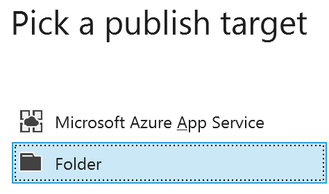
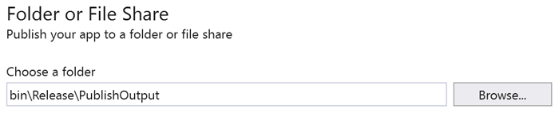
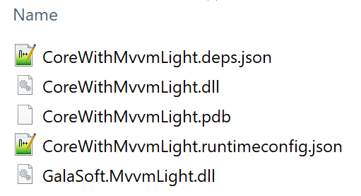

# Publishing the app

A small difference with .NET "Classic" is that you need to publish a .NET Core application before you can copy the DLLs to another machine. While we were able to run the app on Windows earlier (directly from Visual Studio) If you navigate to your bin\Debug (or bin\Release) folder, you will see the console's DLLs but not the referenced GalaSoft.MvvmLight.dll (which we added through Nuget). We need to *publish* the project first. In production, this step should always be done with a CI/CD pipeline and some automation. In this simple sample, however, we can use the integrated tool in Visual Studio:

- In Visual Studio, right click on the CoreWithMvvmLight project and select Publish from the context menu.

- Click on the Start button.

- Pick the "Folder" publish target.

- If needed, modify the path of the publish folder, then press the Publish button.

- Browse to the path of the publish folder. You should now see all the DLLs necessary to run the application.

