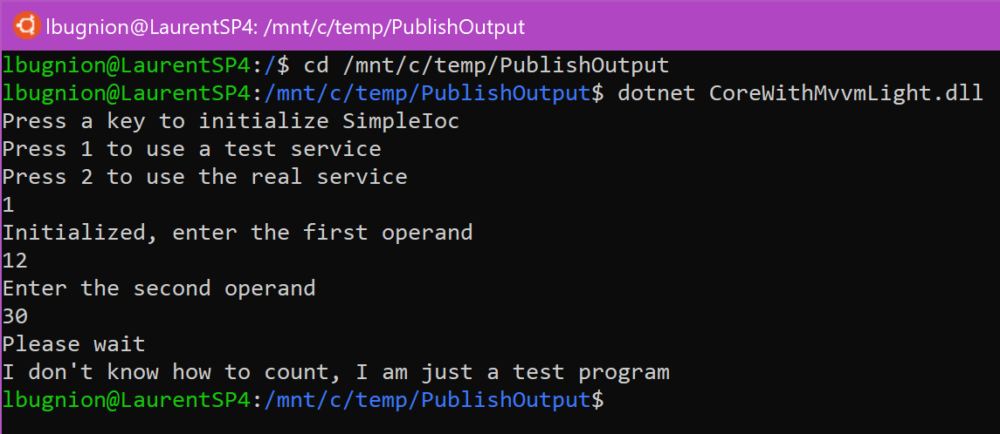
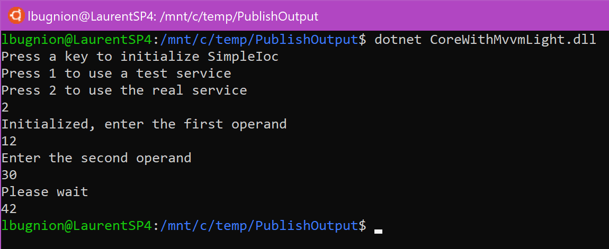

> Before you go on, make sure that you [published the application](./Publish.md) and [tried it on Windows](./RunningWindows.md).

# Running the application on Ubuntu

A simple way to test the .NET Core console application on Ubuntu is to use the Windows Subsystem for Linux. You need to enable the subsystem on Windows first, for example [from Powershell as described here](http://gslb.ch/a148a).

Then you can install a Linux distribution on Windows 10 from the Windows Store. You can even choose which Linux subsystem you want. In our case [we will use Ubuntu](http://gslb.ch/a149a).

## Installing .NET on Linux

You can [follow these instruction](http://gslb.ch/a150a) to install and run .NET Core applications on Linux.

## Running the application on Linux

With .NET Core installed, you can navigate to the folder in which the binaries are placed. For example if your debug folder is in

```
C:\temp\PublishOutput
```

You can navigate to it in Ubuntu with the command ```cd``` and the corresponding path starting with ```mnt```:

```
cd /mnt/c/temp/PublishOutput
```

Then you can run the application with the following command:

```
dotnet CoreWithMvvmLight.dll
```

You should now be able to see and use the application:





## Conclusion

I hope that this sample was useful in demonstrating how .NET Core works on Windows and Linux, and how you can now take advantage of the [.NET Standard version of MVVM Light](http://www.mvvmlight.net/std10). Of course this is a simple sample application, but you can also use MVVM Light in [ASP.NET Core applications running on Linux](http://gslb.ch/a141a), in [Azure Functions on Linux](http://gslb.ch/a10a), etc. In addition, you can also of course use MVVM Light for .NET Standard in Xamarin or Windows applications, to build them using the MVVM pattern and have a maximum compatibility with .NET Standard componens.

Happy coding,
Laurent 