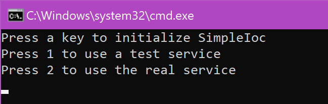
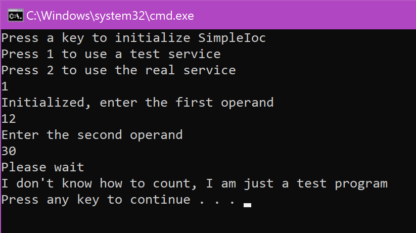
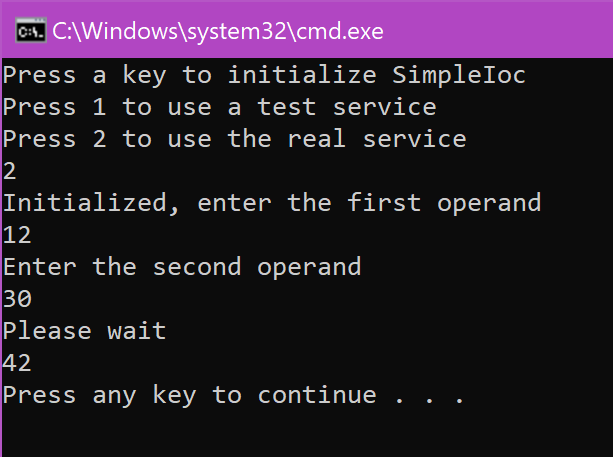

> Before you go on, make sure that you [published the app](./Publish.md)!!

# Running the application on Windows

As you may see in the Publish folder, there is no EXE in this folder. In order to run the .NET Core console application as a standalone, you need the "dotnet" command line instruction, which is available [after you install .NET Core on the target machine](http://gslb.ch/a151a).

- Open a command line console.

- Navigate to the output folder, for example:

```
cd C:\temp\PublishOutput
```

- Run the following command:

```
dotnet CoreWithMvvmLight.dll
```

You should now see the application running and try the options.







> Now you can [run the application on Ubuntu](./RunningUbuntu.md)!
